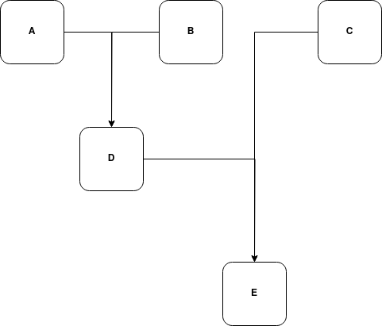
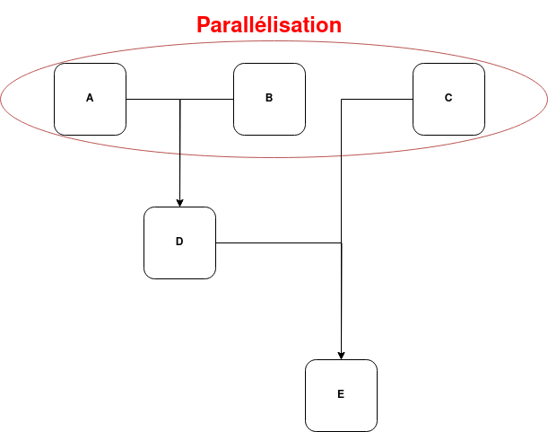
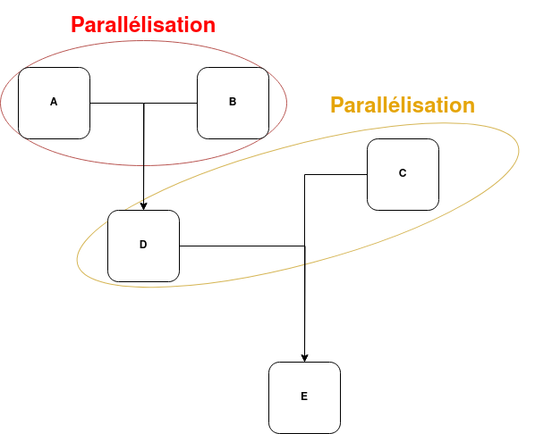
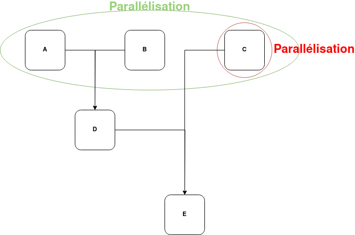

# Compte rendu TP4

- [Compte rendu TP4](#compte-rendu-tp4)
	- [Rapel des valeurs](#rapel-des-valeurs)
	- [Graphe de dépendances](#graphe-de-dépendances)
	- [Temps théorique](#temps-théorique)
		- [Version séquenciel](#version-séquenciel)
		- [Version parallèle V1](#version-parallèle-v1)
		- [Version parallèle V2](#version-parallèle-v2)
		- [Version parallèle V3](#version-parallèle-v3)
	- [ Calcul Experimentaux](#calcul-experimentaux)
		- [Comment compiler le programme](#comment-compiler-le-programme)
		- [Valeurs experimentales](#valeurs-experimentales)

## Rapel des valeurs

IT  | hypothèse 1| hypothèse 2 | hypothèse 3
--- |--- | --- | ---
ITA | 8 | 8  | 2
ITB | 8 | 4  | 5
ITC | 7 | 3  | 4
ITD | 2 | 7  | 7
ITE | 1 | 1  | 1

Le PAS vaut 1 tour de boucle dans les calculs théoriques.

## Graphe de dépendances



## Temps théorique

### Version séquenciel

Pour chaque hypothèse nous avons un temps de `(PAS * ITA)³ + (PAS * ITB)³ + (PAS * ITC)³ + (PAS * ITD)³ + (PAS * ITE)³`.

Pour l'hypothèse 1 nous aurons un temps de 1 376 tours de boucle.

Pour l'hypothèse 2 nous aurons un temps de 947 tours de boucle.

Pour l'hypothèse 3 nous aurons un temps de 323 tours de boucle.

### Version parallèle V1



 Dans cette version, les calculs de A, B et C sont parallèlisés. Le calcul de temps sera de `MAX((PAS * ITA)^3  ;(PAS * ITB)^3 ; (PAS * ITC)^3 )+ (PAS * ITD)^3 + (PAS * ITE)^3`.

 Pour l'hypothèse 1 : un temps de 521 tours de boucle. L'accélération est de 2,641 et l'efficacité de 0,88 (accélération/3)

 Pour l'hypothèse 2 : un temps de 856 tours de boucle. L'accélération est de 1,106 et l'efficacité de 0,37 (accélération/3).

 Pour l'hypothèse 3 : un temps de 251 tours de boucle. L'accélération est de 1,286 et l'efficacité de 0,43 (accélération/3)

### Version parallèle V2



Dans cette version, les calculs de A et B sont parallèlisés et C et D sont parallèlisés. Le calcul sera de : `MAX ((PAS * ITA1)^3 ; (PAS * ITB1)^3) + MAX ((PAS * ITC1)^3 ; (PAS * ITD1)^3 )+ (PAS * ITE1)^3`

Pour l'hypothèse 1 : un temps de 856 tours de boucle. L'accélération est de 1.06 et l'efficacité de 0,53 (accélération/3)

Pour l'hypothèse 2 : un temps de 856 tours de boucle. L'accélération est de 1,106 et l'efficacité de 0,37 (accélération/3), soit les même resultat que la version parallèle V1.

Pour l'hypothèse 3 : un temps de 251 tours de boucle. L'accélération est de 1,286 et l'efficacité de 0,43 (accélération/3), soit les même resultat que la version parallèle V1.

### Version parallèle V3



Dans cette version, les calculs de A B C sont parallèlisés et dedans on a C qui se fait en paralèle de A et B. Le calcul sera de : `MAX(MAX((PAS * ITA1)^3; (PAS * ITB1)^3 )  ;(PAS * ITC3)^3)+ (PAS * ITD1)^3 + (PAS * ITE1)^3̀`

Pour l'hypothèse 1 : un temps de 521 tours de boucle. L'accélération est de 2,641 et l'efficacité de 0,88 (accélération/3), soit les même resultat que la version parallèle V1.

Pour l'hypothèse 2 : un temps de 856 tours de boucle. L'accélération est de 1,106 et l'efficacité de 0,37 (accélération/3), soit les même resultat que la version parallèle V2 et V1.

Pour l'hypothèse 3 : un temps de 251 tours de boucle. L'accélération est de 1,286 et l'efficacité de 0,43 (accélération/3). Soit les même resultat que la version parallèle V2 et V1.

##  Calcul Experimentaux

### Comment compiler le programme

```sh
 gcc -Wall -fopenmp -lm  -DHYPOTHESE=3 -DPAS=200 prog8.c -o prog8.out
```

Il est important de faire passer la valeur de l'hypothèse avec `DHYPOTHESE` pour selectionner l'hypothèse a utiliser. Ce paramètre est important sinon un warning est levé.
Le paramètre optionnel `DPAS` permet de modifier le nombre de pas.  

### Valeurs experimentales

Dans les calculs qui suivent  nous avons utiliser un pas à 200 sur une machine de l'université (Salle micro 1.1B).

Voici les resultats pour la version parralèle 1, avec 8 cœurs de disponibles :

```text
acceleration Hypothèse 1 = 2.43252 | efficacité Hypothèse 1 = 0.304065 
acceleration Hypothèse 2 = 1.06735 | efficacité Hypothèse 2 = 0.133419 
acceleration Hypothèse 3 = 1.05934 | efficacité Hypothèse 3 = 0.132417 
```

Voici les resultats pour la version parralèle  2 :

```text
acceleration Hypothèse 1 = 1.09127 | efficacité Hypothèse 1 = 0.136408 
acceleration Hypothèse 2 = 1.55375 | efficacité Hypothèse 2 = 0.194219 
acceleration Hypothèse 3 = 1.06423 | efficacité Hypothèse 3 = 0.133029 
```

Voici les resultats pour la version parralèle 3 :

```text
accelerationHypothèse 1 = 2.4577 | efficacité Hypothèse 1 = 0.819256 
accelerationHypothèse 3 = 1.0824 | efficacité Hypothèse 3 = 0.360818 
accelerationHypothèse 3 = 1.0384 | efficacité Hypothèse 3 = 0.346132 
```
